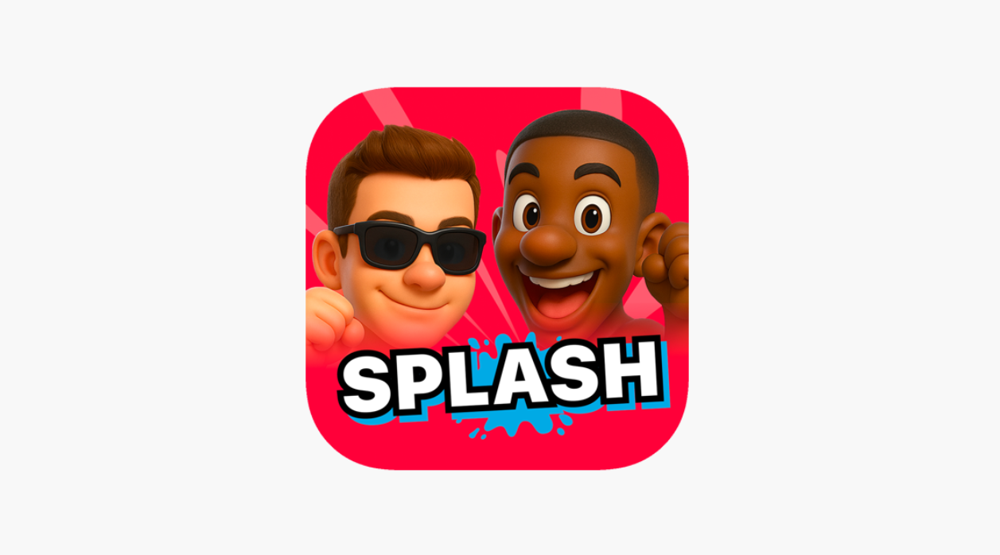

## 🎮 Splash PartySpiele APK – Dive Into the Ultimate Water-Fight Adventure!

Splash PartySpiele APK is a thrilling action-party simulation game designed to deliver chaotic fun and refreshing competition. Developed by AquaByte Studios and launched in 2024, this game has quickly become a must-have summer escape on Android devices. Imagine combining paintball-style mayhem with pool-party vibes — that’s Splash PartySpiele in a nutshell!
>Download: [Splash PartySpiele APK](https://apkmodjoy.net/splash-partyspiele/)
-----------------

## ⚔️ Storyline/Objectives
There’s no complex lore here. The objective is simple: out-splash your rivals! Join virtual water fights with other players in colorful arenas like backyard pools, water parks, and beachside zones. Compete in mini-games, win challenges, and become the ultimate water warrior.

## 🕹️ Gameplay
The controls are smooth and beginner-friendly: tap to move, swipe to splash, and drag to dodge. Splash PartySpiele offers various modes including Free-for-All, Team Splash, and Capture the Float. Earn coins, unlock new water weapons, and upgrade your gear to dominate each match. It’s fast-paced, unpredictable, and endlessly replayable.

## 🎨 Graphics & Sound
The game shines with 3D cartoon-style graphics that explode with vibrant colors and smooth animations. Water effects are especially satisfying. The playful background music and splashing sound effects create a light-hearted and immersive atmosphere — perfect for all ages.

## 🛠️ Key Features

* Multiplayer real-time battles
* Dozens of splash weapons & skins
* Customizable characters
* Seasonal events & rewards
* Offline mode with AI bots

## ⚙️ Requirements

* Size: \~150 MB
* Android 6.0+
* APK version available via trusted sites (search: “Splash PartySpiele APK download”)

## 💬 Pros & Cons
✔ Fun and casual gameplay
✔ Great for quick matches
✘ Limited solo content
✘ Occasional connection drops in multiplayer

## 🌟 Review
Splash PartySpiele is surprisingly addictive. It’s light-hearted, easy to play, and perfect for casual gamers or younger audiences. Ideal for hot summer days or social gaming nights.

## 📝 Conclusion
If you’re looking for a joyful, fast-paced multiplayer game with vibrant visuals and splashy chaos, Splash PartySpiele APK is a blast to play.

## 📥 CTA
Download Splash PartySpiele APK now and bring the water-fight to your screen! Ready to soak your friends? Let the splashing begin! 💦